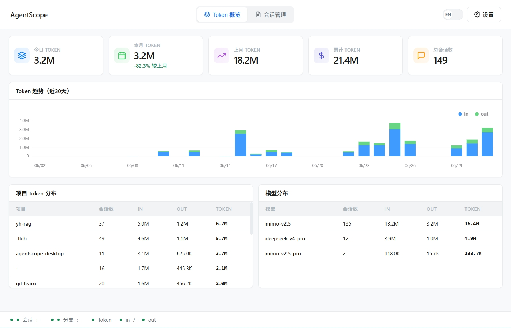
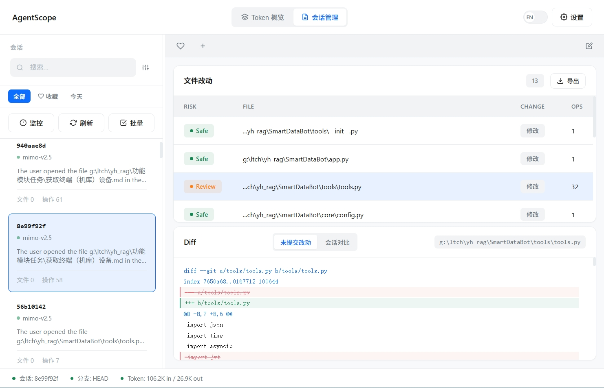

<p align="center">
  
</p>

<h1 align="center">AgentScope</h1>

<p align="center">
  <strong>Claude Code 的可视化控制台 — 看清每次对话、掌控每笔 Token 消耗</strong>
</p>

<p align="center">
  
  
  
  
  
  
</p>

<p align="center">
  <a href="https://github.com/foxpup11/agentscope/releases/latest">下载 v0.4.1</a> ·
  <a href="#-快速上手">30 秒上手</a> ·
  <a href="#-功能一览">功能一览</a> ·
  <a href="#-从源码构建">构建</a> ·
  <a href="#-roadmap">Roadmap</a>
</p>

---

## 💡 这是什么？

**AgentScope** 是一个开箱即用的桌面工具，专为 **Claude Code** 用户设计。

它直接读取 Claude Code 生成的本地会话文件（`~/.claude/projects/`），帮你做到：

- 🔍 **看清每次对话** — 完整回放用户消息、AI 思考过程、工具调用
- 💰 **Token 费用透明** — 实时统计今日/本月/累计消耗，趋势图一目了然
- ⚠️ **风险自动评估** — 文件改动分级（Safe / Review / Danger），危险操作一眼识别
- 📝 **知识库管理** — Plans、Memory、CLAUDE.md 集中管理，支持一键生成

> **零配置、零侵入** — 不需要 API Key，不需要联网，它只是帮你更清楚地看到 Claude Code 已经做了什么。

---

## 🎬 30 秒上手

### 1. 下载

👉 [**点击下载最新版本**](https://github.com/foxpup11/agentscope/releases/latest)（约 12MB，无需安装）

### 2. 运行

双击 `agentscope-desktop.exe`，直接打开。

### 3. 开始使用

选择左侧任意会话，即可查看对话记录、文件改动、Token 消耗。



---

## ✨ 功能一览

### 📊 Token 仪表盘

| 功能 | 说明 |
|------|------|
| 5 张概览卡片 | 今日 / 本月 / 上月 / 累计 Token + 总会话数 |
| 30 天趋势图 | Input（蓝）+ Output（绿）堆叠柱状图 |
| 项目维度分析 | 按项目分组统计 Token 消耗 |
| 模型维度分析 | 识别不同模型使用占比 |
| 月度对比 | 本月 vs 上月百分比变化 |

### 🔍 会话管理

| 功能 | 说明 |
|------|------|
| 全文搜索 | 搜索 Prompt、模型、分支、标签 |
| 标签系统 | 手动打标签 + 17 条自动识别规则 |
| 会话收藏 | 一键收藏重要会话 |
| 批量操作 | 批量收藏、导出、删除 |
| 项目分组 | 按项目自动分组，折叠/展开 |
| 实时监控 | 文件系统变化自动刷新 |

### 💬 对话记录

| 功能 | 说明 |
|------|------|
| 完整回放 | 用户消息、AI 回复、思考过程 |
| 工具调用 | 展示 AI 调用了哪些工具 |
| 时间戳 | 每条消息精确到秒 |

### 📁 文件改动 & Diff

| 功能 | 说明 |
|------|------|
| 风险评估 | 🔴 Danger / 🟡 Review / 🟢 Safe 自动分级 |
| Diff 查看 | 语法高亮，支持未提交 / 会话对比两种模式 |
| 变更类型 | Created / Modified / Deleted 一目了然 |

### 📝 知识库

| 功能 | 说明 |
|------|------|
| Plans | 管理 Claude Code 的计划文档 |
| Memory | 管理项目记忆文件 |
| CLAUDE.md 编辑器 | 分段编辑 + 实时预览 |
| CLAUDE.md 生成器 | 自动检测项目结构，一键生成 |

### ⚙️ 其他特性

| 功能 | 说明 |
|------|------|
| 主题 | 浅色 / 深色 / 跟随系统 |
| 自定义风险规则 | 按文件路径模式匹配自定义规则 |
| 导出 | 单条或批量导出为 Markdown |
| 国际化 | 中文 / English 一键切换 |
| 开箱即用 | 无需安装、无需 API Key、离线可用 |

---

## 🖼️ 预览




---

## 🛡️ 风险评估引擎

AgentScope 内置智能风险评估，自动识别危险操作：

| 风险等级 | 触发条件 | 你会看到 |
|----------|----------|----------|
| 🔴 **Danger** | 删除文件、敏感文件、危险命令 | 红色警告 |
| 🟡 **Review** | 修改依赖、多次编辑、删除代码 | 黄色提醒 |
| 🟢 **Safe** | 新增文件、小改动、文档修改 | 绿色通过 |

**检测的危险操作：**
- 🗑️ 删除文件
- 🔑 敏感文件（`.env`, `secret`, `password`, `token`）
- ⚠️ 危险命令（`rm -rf`, `chmod 777`, `curl | bash`）
- 📦 配置文件（`.git/config`, `Dockerfile`, CI 配置）

---

## 📦 下载安装

### 方式一：直接下载（推荐）

前往 [Releases](https://github.com/foxpup11/agentscope/releases/latest) 下载最新版本。

| 文件 | 说明 |
|------|------|
| `agentscope-desktop.exe` | Windows 可执行文件，约 12MB |

### 方式二：从源码构建

```bash
# 前置条件
# - Go 1.21+
# - Wails v2: go install github.com/wailsapp/wails/v2/cmd/wails@latest

# 克隆仓库
git clone https://github.com/foxpup11/agentscope.git
cd agentscope

# 安装依赖
go mod tidy

# 开发模式（热重载）
wails dev

# 构建生产版本
wails build -platform windows/amd64 -o agentscope-desktop.exe
```

---

## 🗺️ Roadmap

### ✅ 已完成

- [x] Claude Code 会话解析
- [x] 文件改动列表与风险评估
- [x] Diff 语法高亮
- [x] 中英文切换
- [x] 可拖拽布局
- [x] 实时监控
- [x] 会话导出
- [x] 深色主题
- [x] 自定义风险规则
- [x] 项目分组
- [x] Token 仪表盘（5 卡片 + 趋势图 + 双表格）
- [x] 全文搜索 + 高级筛选
- [x] 标签系统（手动 + 17 条自动识别）
- [x] 会话收藏 + 批量操作
- [x] 对话记录完整回放
- [x] CLAUDE.md 可视化编辑器
- [x] CLAUDE.md 模板生成器
- [x] 知识库管理（Plans / Memory / CLAUDE.md）

### 🔜 计划中

- [ ] ⚙️ Hooks / MCP 配置 GUI
- [ ] ✨ 智能提交信息生成
- [ ] 📋 提示词模板库
- [ ] 📊 使用洞察报告
- [ ] 🌐 macOS / Linux 支持

---

## 🤝 贡献

欢迎贡献！无论是提交 Bug、建议新功能，还是直接贡献代码。

1. Fork 本仓库
2. 创建特性分支 (`git checkout -b feature/amazing-feature`)
3. 提交更改 (`git commit -m 'feat: add amazing feature'`)
4. 推送到分支 (`git push origin feature/amazing-feature`)
5. 创建 Pull Request

---

## 📄 License

MIT License — 自由使用，自由分享。

---

<p align="center">
  <strong>⭐ 如果 AgentScope 帮到了你，请给个 Star 支持一下！</strong>
</p>

<p align="center">
  <sub>Made with ❤️ by <a href="https://github.com/foxpup11">foxpup11</a></sub>
</p>
